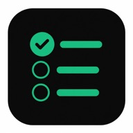

  

# Listly

**Shared lists for getting things done together.**

## The Problem

Coordinating tasks with your partner, roommates, or family is a mess. Shared notes apps work but feel clunky, and you can never tell who's doing what or what needs to happen today.

## The Solution

Listly is a collaborative task list PWA. Create lists, share them by email, assign items to specific people, and set a draggable "today" line to prioritize what matters now. Real-time sync means everyone sees changes instantly. Checking off the last item triggers a confetti celebration.

## Who It's For

- Couples splitting household tasks
- Roommates coordinating chores and errands
- Families managing shared to-dos
- Small teams that want something simpler than project management tools

## Key Features

- Google sign-in
- Create multiple lists with custom emoji
- Share lists with specific people by email
- Assign items to members with colored initials
- Draggable "today" line to separate what's for today vs later
- Real-time sync via Supabase subscriptions
- Confetti animation on check-off (triple celebration when all done)
- Drag-to-reorder items
- Installable as a PWA on mobile

## Tech Stack

Next.js, Supabase (Postgres + Auth + Real-time), Vercel, Cloudflare DNS, PWA

## Live

https://listly.franciscocucullu.com

---

## Author

**Francisco Cucullu** — Software engineer and indie developer building side projects from scratch.

- Website: [franciscocucullu.com](https://franciscocucullu.com)
- LinkedIn: [linkedin.com/in/franciscocucullu](https://linkedin.com/in/franciscocucullu)
- All apps: [franciscocucullu.com/apps](https://franciscocucullu.com/apps)
